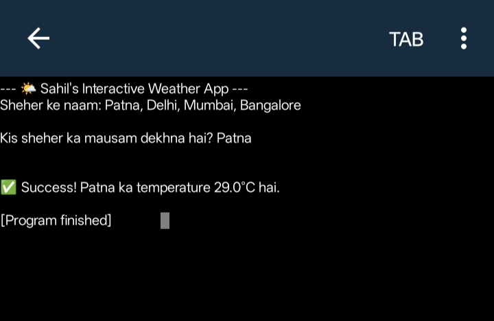

# 🚀 My Python Learning Journey
Hi! I'm **Md Sahil**, a dedicated BCA Student at **IIBM Patna**. 🎓 This repository documents my hands-on journey as I master Python programming and build logic for software development.

---

## 🛠️ Tech Stack
* **Language:** Python 3.x
* **Libraries:** Requests (API), Datetime
* **Tools:** GitHub, Pydroid 3 (Mobile Development)

---

## 🌟 Featured Projects

### 1. 🌤️ Interactive Weather Application
A real-time application that fetches live satellite data to provide current weather updates.
* **Key Features:**
    * Fetches live data from the **Open-Meteo API**.
    * Supports dynamic user input for city-specific searches (e.g., Patna, Delhi, Mumbai).
    * Implemented **Error Handling** to manage invalid city names.
* **Project Preview:**

### 2. 📝 Smart Task Manager
A command-line tool designed to help users manage daily activities with priority settings.
* **Key Features:**
    * Task prioritization: High (H), Medium (M), and Low (L).
    * Color-coded status indicators for better visualization.
* **Project Preview:**

---

## 📬 Connect with Me
I'm always open to collaborating on interesting Python projects or discussing tech!
* **LinkedIn:** [Verified Profile](https://www.linkedin.com/in/md-sahil) 🛡️
* **GitHub:** [sahil821093](https://github.com/sahil821093)

---
⭐️ *If you find my projects helpful, feel free to give this repo a star!*
