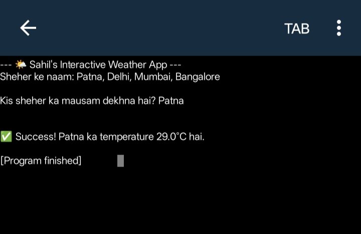
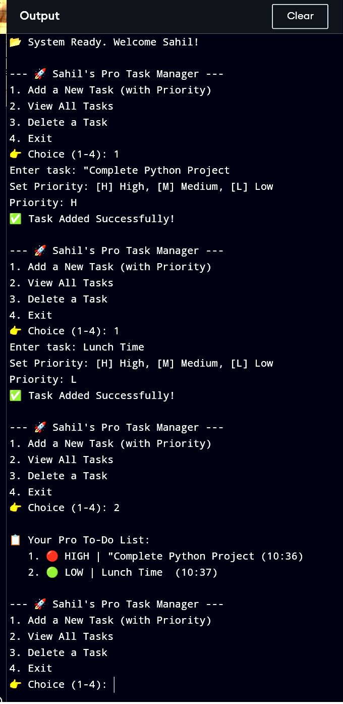
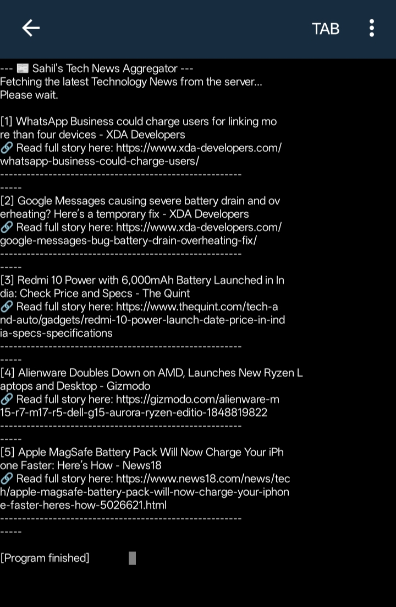
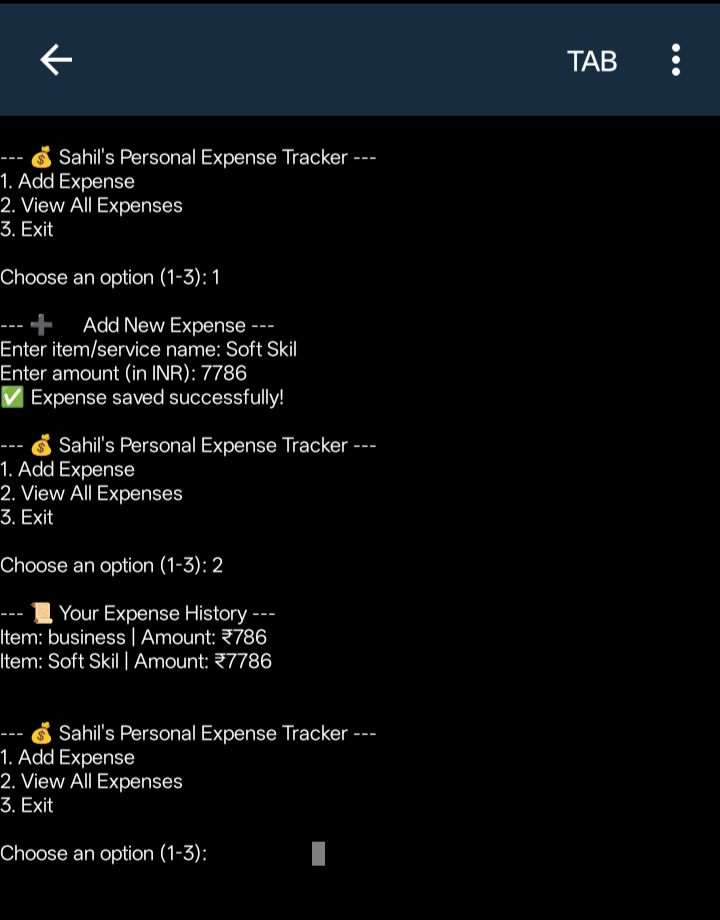
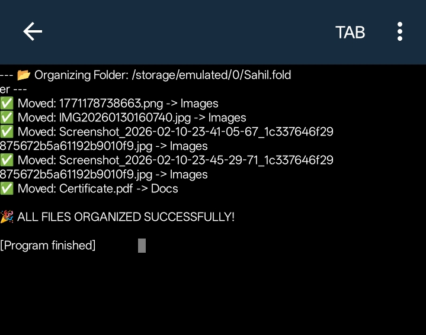
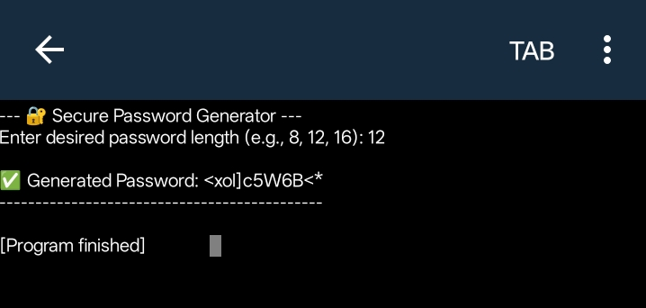
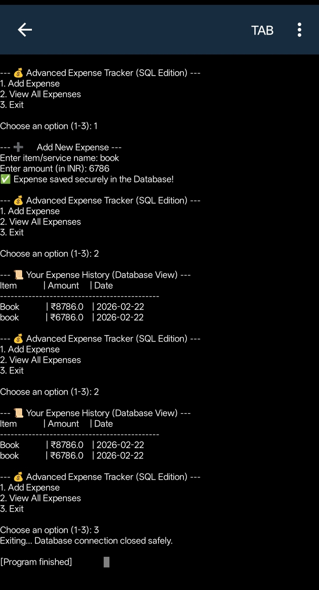

# 🚀 My Python Learning Journey
Hi! I'm **Md Sahil**, a dedicated BCA Student at **IIBM Patna**. 🎓 This repository documents my hands-on journey as I master Python programming and build logic for software development.

---

## 🛠️ Tech Stack
* **Language:** Python 3.x
* **Libraries:** Requests (API), Datetime
* **Tools:** GitHub, Pydroid 3 (Mobile Development)

---

## 🌟 Featured Projects

### 1. 🌤️ Interactive Weather Application
A real-time application that fetches live satellite data to provide current weather updates.
* **Key Features:**
    * Fetches live data from the **Open-Meteo API**.
    * Supports dynamic user input for city-specific searches (e.g., Patna, Delhi, Mumbai).
    * Implemented **Error Handling** to manage invalid city names.
* **Project Preview:**

### 2. 📝 Smart Task Manager
A command-line tool designed to help users manage daily activities with priority settings.
* **Key Features:**
    * Task prioritization: High (H), Medium (M), and Low (L).
    * Color-coded status indicators for better visualization.
* **Project Preview:**

---

### 3. 📰 Tech News Aggregator
A real-time Python application that connects to a news server to fetch the latest technology headlines from India.
* **Key Features:**
    * Fetches live data using a public **REST API**.
    * Uses **List Slicing** to display only the top 5 most relevant articles.
    * Provides direct URLs for each article, ensuring a seamless user experience.
* **Project Preview:**

### 4. 💰 Personal Expense Tracker
A file-based Python application for persistent data storage of daily expenses.
* **Technical Skills:** File I/O (`.txt`), Data Persistence, and While-Loop Logic.

---

### 5. 📂 Smart File Organizer (Automation)
A professional automation script that cleans up cluttered directories by sorting files into categorized folders based on their file extensions. 
* **Technical Highlights:** Automated file sorting using `os` and `shutil` libraries. Professional error handling and workflow scripting.

### 6. 🔐 Secure Password Generator
A robust Python utility designed to generate cryptographically strong and unguessable passwords based on strict security protocols. 
* **Technical Highlights:**
    * **Algorithmic Security:** Enforces mandatory inclusion of uppercase, lowercase, numerical, and special characters (`string` module).
    * **Advanced Randomization:** Utilizes `random.shuffle()` to eliminate predictable sequence patterns, ensuring enterprise-grade password strength.
    * **Input Validation:** Implements logic to enforce a minimum length requirement and gracefully handles invalid user inputs.

---

### 7. 🗄️ Advanced Expense Tracker (SQL Edition)
An upgraded financial tracking application utilizing an SQLite database for robust, high-capacity data storage.
* **Technical Highlights:**
    * **Database Integration:** Implements `sqlite3` for persistent, structured, and secure data management.
    * **Automated Data Handling:** Features auto-generating timestamps (`CURRENT_TIMESTAMP`) and professional tabular formatting for records.

## 📬 Connect with Me
I'm always open to collaborating on interesting Python projects or discussing tech!
* **LinkedIn:** [Verified Profile](https://www.linkedin.com/in/md-sahil) 🛡️
* **GitHub:** [sahil821093](https://github.com/sahil821093)

---
⭐️ *If you find my projects helpful, feel free to give this repo a star!*
